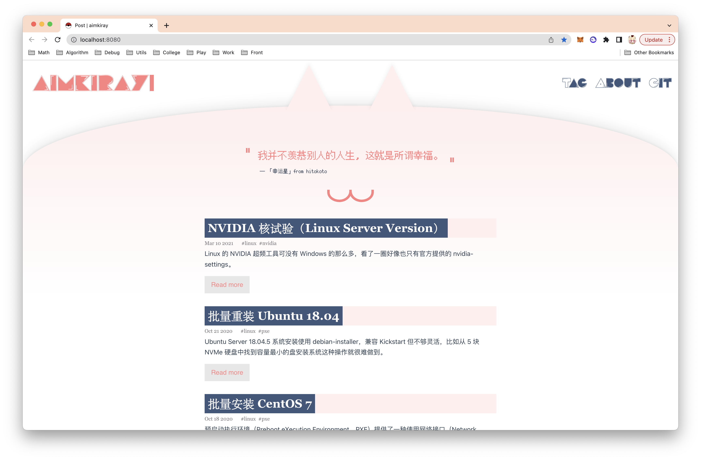
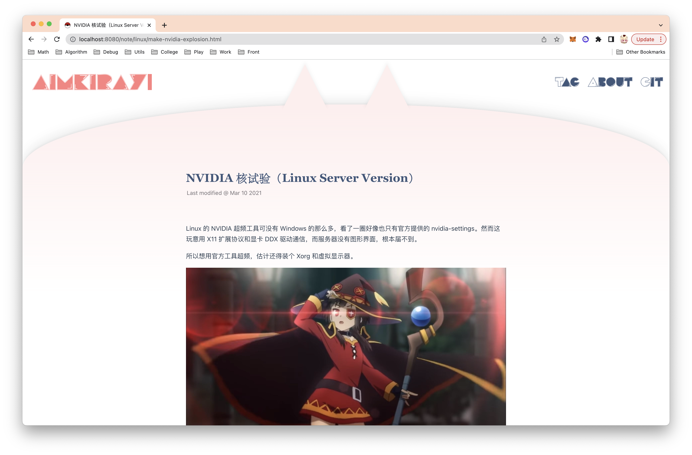
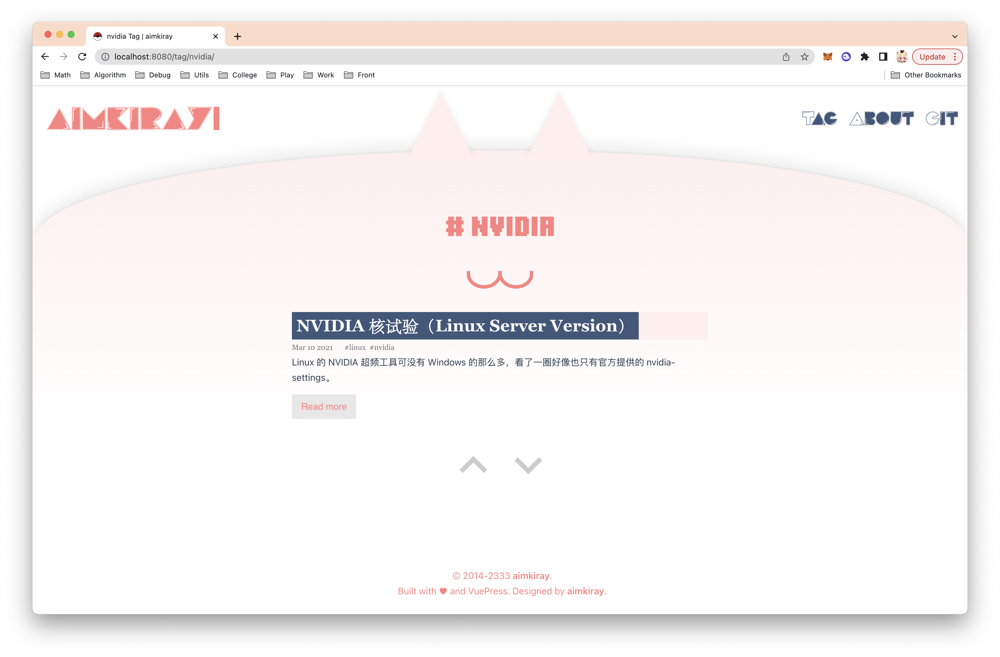

年久失修，请移步 [Nuxt 3 版本](https://github.com/aimkiray/nuxt-theme-blog)

简陋够用的博客主题✕

简洁优雅的博客主题✓

## Screen Shot

- 文章列表（一言来自 hitokoto）



- 文章



- 标签




## Quick Start

To make easier to get started, you can clone this repository and write blog in it. Here's an example:

Step 1: Clone this depository.

```bash
git clone https://github.com/aimkiray/vuepress-theme-palette.git
```

Step 2: Write your blog.

```bash
cd vuepress-theme-palette/docs/note

vim Hello.md
```

Step 3: Develop & Build

```bash
# Run localhost
yarn dev

# Build your blog
yarn build
```

By default, VuePress dev server is listening at `http://localhost:8080/`, whereas the built files will be in `docs/.vuepress/dist`.
